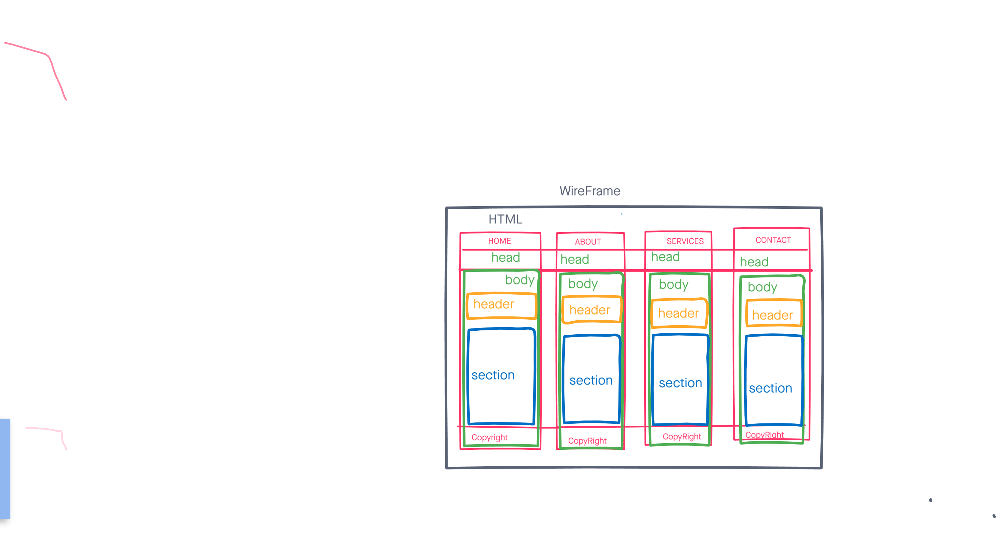

# Development Strategy

#### AppTheme

A basic development with semantic layout for HTML, CSS & FLEXBOX, developed collboratively useing branches in each step   
## Wireframe

<!-- include a wireframe for your project in this repository, and display it here -->
<!-- wireframe.cc is a good site for getting started with wireframes -->


## 0. Set-Up

__A User can see my initial repository and live demo__

### Repository

- Generated as this [starter template](https://github.com/HackYourFutureBelgium/w3-validation-template)
- Clone the repository
- Give a title and description of your project to your README
- Add meta tags ,css file links and title in the head
- Add wireframe
- Push the changes
- Turn on GitHub Pages

## 1. Using  FLEXBOX grid  semantic in HTML  &  CSS

 The user story was developed on branch **` p-flexbox`**

### HTML

- Add the elements like ``` <header>, <nav>, <body>, <section> & <footer> ```
- Add the flexbox **row**

       row wich is end-sm end-md end-lg  center-xs middle-xs middle-sm middle-md middle-lg in the header 
       row center-xs center-sm center-md center-lg middle-xs middle-sm middle-md middle-lg in the showcase 
       row center-xs center-sm center-md center-lg in the section features 
       row center-xs center-sm center-md center-lg in the icon 
       row center-xs center-sm center-md center-lg in the info section 
       row center-xs center-sm center-md center-lg in the footer

- Add the flexbox **col**
       
       col-xs-12 col-sm-2 col-md-2 col-lg-2 in the header 
       col-xs-12 col-sm-10 col-md-10 col-lg-10 navbar lists 
       col-xs-12 col-sm-12 col-lg-11 showcase-content
       col-xs-12 col-sm-12 col-md-12 col-lg-12 in the section features 
       col-xs-12 col-sm-4 col-md-4 col-lg-4 in the icon row 1
       col-xs-12 col-sm-4 col-md-4 col-lg-4 in the icon row 2
       col-xs-12 col-sm-6 col-md-6 col-lg-6 info section
       col-xs-12 col-sm-4 col-md-4 col-lg-4 company area 
       col-xs-12 col-sm-12 col-md-12 col-lg-12 footer  

### CSS

I add a lot of CSS files and  you can find [hier]() will lead to my GitHub 
### Validation 
_As coaches, we want to see all pages are validated by [Markup Validation Service](https://validator.w3.org/) and [CSS Validation Service](https://jigsaw.w3.org/css-validator/)__


### Repo

This user story was developed on a branch called **p-validation**

